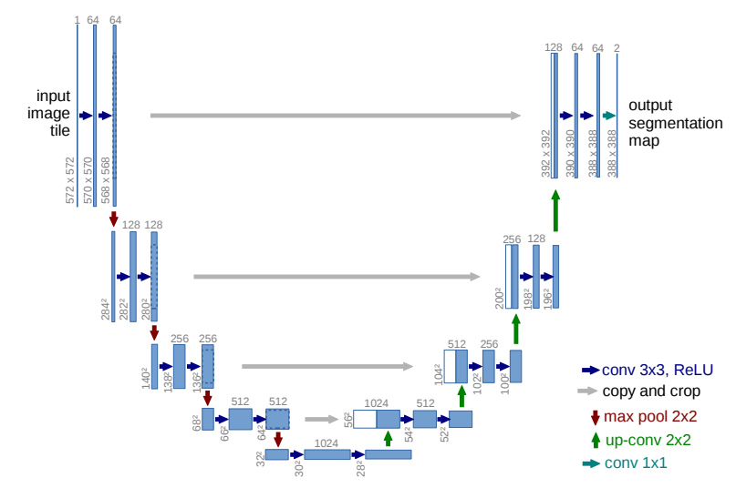

# U-Net for Image Segmentation

## Project Overview
This repository contains an implementation of the **U-Net architecture** in PyTorch according to the original paper. 
The focus is on building the model definition — the network has not yet been trained or evaluated on any dataset.  

## U-Net Architecture
Encoder - Bottleneck - Decoder (upsampling, *not yet fully understand* skip connection)

## Future Work
Image segmentation using U-Net on many datasets 

## References
1. Olaf Ronneberger, Philipp Fischer & Thomas Brox. *U-Net: Convolutional Networks for Biomedical Image Segmentation.* 2015. [https://arxiv.org/abs/1505.04597](https://arxiv.org/abs/1505.04597)
2. [Aladdin Persson](https://www.youtube.com/@AladdinPersson). PyTorch Image Segmentation Tutorial with U-NET: everything from scratch baby. [Youtube](https://www.youtube.com/watch?v=IHq1t7NxS8k&t=1275s)
